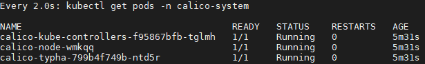

:::danger
Beta de l'installation Calico, ne __PAS__ suivre ce tuto.

Cette page contient uniquement des éléments d'une installation plus ancienne et non complète de Calico.
::: 

Juste après cette étape dans le tutos [ici](../Kubernetes/1_install_&_configuration/1_install_VM.md)
```bash
sudo apt-mark hold docker.io kubelet kubeadm kubectl
```

Installation de [Calico](https://docs.projectcalico.org/getting-started/kubernetes/quickstart)

## Create a single-host Kubernetes cluster

Initialisation du master
```bash
sudo kubeadm init --pod-network-cidr=192.168.0.0/16
```


## Install Calico

```bash
kubectl create -f https://docs.projectcalico.org/manifests/tigera-operator.yaml
```

:::caution Attention
Avant d'executer la commande, il est important de vérifier si le manifest.xml comporte les bonnes informations IP.
Il n'est __PAS__ possible de les modifier ensuite.
:::

```bash
kubectl create -f https://docs.projectcalico.org/manifests/custom-resources.yaml
```

Patienter jusqu'a ce que tous les pods aient le status <code>Running</code>
```bash
watch kubectl get pods -n calico-system
```


Taint le serveur Master, car aucun pods ne s'exécuterons dessus
```bash
kubectl taint nodes --all node-role.kubernetes.io/master-
```


Confirmer que vous avez bien une Node dans votre cluster
```bash
kubectl get nodes -o wide
```


Féliciations !! Vous avez maintenant un simple cluster Kubernetes avec Calico

## Install calicoctl
A faire sur Master et Nodes.

Aller dans /usr/bin/local pour définir la commande comme étant dans le <code>PATH</code>
```bash
cd /usr/local/bin/
sudo curl -O -L  https://github.com/projectcalico/calicoctl/releases/download/v3.18.1/calicoctl
sudo chmod +x calicoctl
```

Création d'une configuratioh de calico

```bash
sudo mkdir /etc/calico
```

Création d'un fichier dans /etc/calico/calicoctl.cfg
```yaml
apiVersion: projectcalico.org/v3
kind: CalicoAPIConfig
metadata:
spec:
  datastoreType: "kubernetes"
  kubeconfig: "/home/<user>/.kube/config"
```

Tester la bonne installation de calicoctl
```bash
calicoctl -h
# Ou
calicoctl get nodes
```

## Install Calico on Nodes

Création d'un token pour ajouter les nodes (master)

```bash
kubeadm token create --print-join-command
```

Ajout de la node (Node)
```bash
sudo kubeadm join 192.168.1.14:6443 --token <your_token> --discovery-token-ca-cert-hash sha256:<your_discovery_token>
```

```bash
sudo calicoctl node status
```


```bash
curl https://docs.projectcalico.org/manifests/calico.yaml -O
```

:::caution Attention
Avant d'executer la commande, il est important de vérifier si le calico.yaml comporte les bonnes informations IP.

Passez cet averstissmenet si votre CIDR est <code>192.168.0.0/16</code>.

Sinon décommenter la ligne <code>CALICO_IPV4POOL_CIDR</code> et mettez la valeur correspondante
:::

```bash
kubectl apply -f calico.yaml
```

create BGPConfiguration

```yaml
apiVersion: projectcalico.org/v3
kind: BGPConfiguration
metadata:
  name: default
spec:
  logSeverityScreen: Info
  nodeToNodeMeshEnabled: true
  asNumber: 63400
  serviceClusterIPs:
  - cidr: 10.96.0.0/12
  serviceExternalIPs:
  - cidr: 104.244.42.129/32
  - cidr: 172.217.3.0/24
  listenPort: 178
  communities:
  - name: bgp-large-community
    value: 63400:300:100
  prefixAdvertisements:
  - cidr: 172.218.4.0/26
    communities:
    - bgp-large-community
    - 63400:120
```

Désactiver le node-To-Node Mesh
```bash
calicoctl patch bgpconfiguration default -p '{"spec": {"nodeToNodeMeshEnabled": false}}'
```

Create BGPeer Global

```bash
cat << EOF | calicoctl create -f -cali
apiVersion: projectcalico.org/v3
kind: BGPPeer
metadata:
  name: bgppeer-global
spec:
  peerIP: 192.20.30.40
  asNumber: 64567
EOF
```

Create Node

```yaml
apiVersion: projectcalico.org/v3
kind: Node
metadata:
  name: node1
spec:
  bgp:
    asNumber: 64567
    ipv4Address: 192.20.30.40

```

## Day 2

Install via site [kubernetes](https://kubernetes.io/docs/setup/production-environment/tools/kubeadm/install-kubeadm/#installing-kubeadm-kubelet-and-kubectl)
ne pas oublier docker.io

Modification fichier sudo nano <code>/etc/sysctl.conf</code>
Décommenter net.ipv4.ip_forward=1

```bash
sudo kubeadm init --pod-network-cidr=192.168.44.0/24
```

join
```
kubeadm join 192.168.1.20:6443 --token ljlmv5.1vtwz037trb4m3qh \
    --discovery-token-ca-cert-hash sha256:3364511780ac81cdf3770a6bdd4a0d3615c7385327a144c6e2c99f10914e83f5
```

process create .kube folder etc...

Ajout resources calico
```bash
kubectl create -f https://docs.projectcalico.org/manifests/tigera-operator.yaml
```

modification fichier custom-resources
```bash
wget https://docs.projectcalico.org/manifests/custom-resources.yaml
```

edit avec le bon CIDR

```yaml
apiVersion: operator.tigera.io/v1
kind: Installation
metadata:
  name: default
spec:
  # Configures Calico networking.
  calicoNetwork:
    # Note: The ipPools section cannot be modified post-install.
    ipPools:
    - blockSize: 26
      cidr: 192.168.44.0/24
      encapsulation: VXLANCrossSubnet
      natOutgoing: Enabled
      nodeSelector: all()
```

creation

```bash
kubectl create -f custom-resources.yaml
```


Taint le serveur Master, car aucun pods ne s'exécuterons dessus
```bash
kubectl taint nodes --all node-role.kubernetes.io/master-
```


Confirmer que vous avez bien une Node dans votre cluster
```bash
kubectl get nodes -o wide
```


Féliciations !! Vous avez maintenant un simple cluster Kubernetes avec Calico

### Go to install calicoctl

Creation fichier cfg (ça sert à quelque chose ?)

Création d'une configuratioh de calico

```bash
sudo mkdir /etc/calico
```

Création d'un fichier dans /etc/calico/calicoctl.cfg
```yaml
apiVersion: projectcalico.org/v3
kind: CalicoAPIConfig
metadata:
spec:
  datastoreType: "kubernetes"
  kubeconfig: "/home/<user>/.kube/config"
```

Join les nodes

On peux lancer un pod qui est répartis