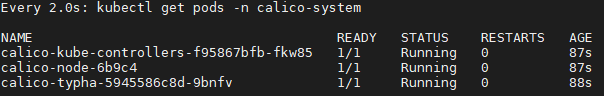
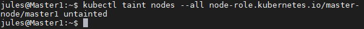

Dans cet exemple nous allons créer un Single Master Kubernetes avec Calico.

Les machines doivent être initialisées en suivant le tuto: [Setup VM](./setup-vm.md).

Lien vers la documentation officelle: [docs.projectcalico.org](https://docs.projectcalico.org/getting-started/kubernetes/self-managed-onprem/onpremises).

## Installation du cluster

Ces étapes sont à faire sur la machine Master uniquement.

### Initialisation du cluster
Initialisation du cluster. L'adresse choisie ne doit pas être occupé dans le réseau existant. Sous risque que les pods ne soit pas accessibles
```bash
sudo kubeadm init --pod-network-cidr=192.168.44.0/24
```

Ne pas oublier de copier la commande <code>kubeadm join</code> donnée à la fin de l'installation, qui servira à lier les nodes avec le master.


Ajout de la commande kubectl exécutable par le user courant.
```bash
mkdir -p $HOME/.kube
sudo cp -i /etc/kubernetes/admin.conf $HOME/.kube/config
sudo chown $(id -u):$(id -g) $HOME/.kube/config
```

### Installation de Calico

Ajout ressources de Calico.
```bash
kubectl create -f https://docs.projectcalico.org/manifests/tigera-operator.yaml
```

Télécharger le fichier <code>custom-resources.yaml</code>

```bash
wget https://docs.projectcalico.org/manifests/custom-resources.yaml
```

Modifer le fichier <code>custom-resources.yaml</code> avec les informations CIDR choisis précédemment.
```yaml
apiVersion: operator.tigera.io/v1
kind: Installation
metadata:
  name: default
spec:
  # Configures Calico networking.
  calicoNetwork:
    # Note: The ipPools section cannot be modified post-install.
    ipPools:
    - blockSize: 26
      cidr: 192.168.44.0/24
      encapsulation: VXLANCrossSubnet
      natOutgoing: Enabled
      nodeSelector: all()
```

Création du fichier que nous venons d'éditer.

```bash
kubectl create -f custom-resources.yaml
```

Les pods suivant doivent se lancer et être à l'état *Running*
```bash
kubectl get pods -n calico-system
```



Taint le serveur Master, car aucun pods personnel ne doit s'exécuter dessus.
```bash
kubectl taint nodes --all node-role.kubernetes.io/master-
```



Confirmer que vous avez bien une Node dans votre cluster
```bash
kubectl get nodes -o wide
```


Féliciations :tada: !! Vous avez maintenant un simple cluster Kubernetes avec Calico

### Installation de Calicoctl

L'ajout de calicoctl permettra d'exécuter des commandes spécifique à la gestion du cluster avec calico.

Aller dans /usr/bin/local pour définir la commande comme étant dans le <code>PATH</code>
```bash
cd /usr/local/bin/
sudo curl -O -L  https://github.com/projectcalico/calicoctl/releases/download/v3.18.1/calicoctl
sudo chmod +x calicoctl
```

Création d'un fichier de configuration pour calico

```bash
sudo mkdir /etc/calico
sudo nano /etc/calico/calicoctl.cfg
```

Création du fichier
```yaml
apiVersion: projectcalico.org/v3
kind: CalicoAPIConfig
metadata:
spec:
  datastoreType: "kubernetes"
  kubeconfig: "/home/<user>/.kube/config"
```

Tester la bonne installation de calicoctl
```bash
calicoctl -h
# Ou
calicoctl get nodes
```

## Ajout des Nodes

Maintenant que la VM Master est prête, il faut ajouter les nodes au cluster.

Exécuter la commande kubeadm join récupéré lors de l'étape [Initialisation du cluster](install-calico#initialisation-du-cluster) sur toutes les nodes.
```bash
kubeadm join 192.168.1.20:6443 --token <your_token> --discovery-token-ca-cert-hash sha256:<your_sha256>
```

A la fin de processus, il est possible de lister les nodes du cluster.
```bash
sudo calicoctl node status
```


Féliciations :tada: !! Votre cluster Kubernetes est maintenant prêt à déployer de nombreux Pods.