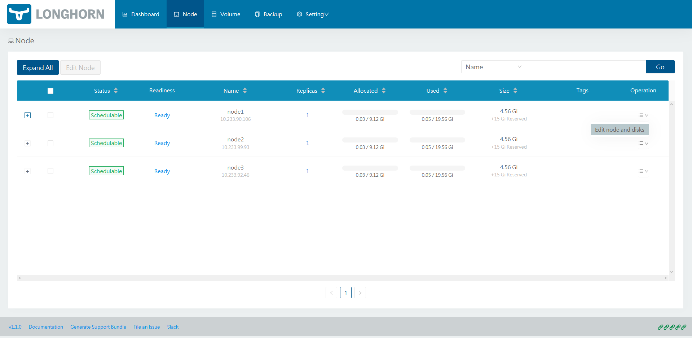

Lien vers la documentation officelle: https://longhorn.io/docs/1.1.0/deploy/install/

check is longhorn est possible

### Verification du l'infrastrucure

Un script est disponible pour vérifier que l'architecture de votre cluster est compatible avec Longhorn.
```
curl -sSfL https://raw.githubusercontent.com/longhorn/longhorn/v1.1.0/scripts/environment_check.sh | bash
```

## Installation de Longhorn

### Prérequis

Ces étapes sont à faire sur toutes les machines constituant le cluster (les Masters et les Nodes).

#### Installer open-iscsi
isntaller sur toutes les vms

```bash
apt-get install open-iscsi
```

#### Installer NFSv4 client

Pour les serveurs utilisant Ubuntu ou Debian
```bash
apt-get install nfs-common
```

Pour RHEL, CentOS et EKS
```bash
yum install nfs-utils
```

#### Version de Kubernetes

Utilisez cette commande pour vérifier votre version de Kubernetes.
```bash
sudo kubectl version
```

La <code>Server Version</code> doit être de <code>v1.16</code> ou supérieure.

### Récupération de l'outil

Nous allons créer un dossier contenant les fichiers de configuration de Longhorn. Puis télécharger et exécuter les fichiers yaml.

https://longhorn.io/docs/1.1.0/deploy/install/install-with-kubectl/

```bash
mkdir longhorn
cd longhorn
wget https://raw.githubusercontent.com/longhorn/longhorn/v1.1.0/deploy/longhorn.yaml

sudo kubectl apply -f longhorn.yaml
```

Pour vérifier que l'installation se déroule correctement, tous les pods doivent avoir le status <code>Running</code>.

```bash
kubectl get pods --namespace longhorn-system --watch
```

## Ajout de disques spécifiques

Cette étape est optionnelle, mais __fortement recommandée__. Elle vise à ajouter des disques durs spécique à longhorn (à faire sur chaque Node).

### Ajouter le disque dur

Ajout un disque dur sur votre Machine de manière physique ou logique, dans cet exemple 20Go seront ajouté.

### Formatter le disque

Lien complémentaire ici: https://www.tecmint.com/add-new-disk-to-an-existing-linux/

Lister tous les disques de votre systemes et sélectionner le nouveau disque, généralement /dev/sdb.
```bash
fdisk -l
fdisk /dev/sdb
```
Dans le menu fdisk sélectionner <code>n</code> et <code>p</code> pour créer et déclarer la nouvelle partition comme partition principale.

Puis <code>w</code> pour sauvegarder la configuration.

Formatage du disque en ext4.
```bash
mfs.ext4  /dev/sdb
```

### Monter le volume

Maintenant que le volume est créer, nous allons le monter automatiquement à chaque démarrage de la machine.

Nous créons un dossier <code>/mnt/longhorn</code> qui sera l'emplacement de notre nouveau disque.
```bash
sudo mkdir /mnt/longhorn
mount /dev/sdb1 /mnt/longhorn
```

Rajouter la ligne dans <code>/etc/fstab</code> pour monter la partition lors du boot.
```bash
/dev/sdb1 /mnt/longhorn ext4 defaults 0 0
```

### Relancer le service Longhorn

Modifier dans le fichier <code>longhorn.yaml</code>.

Allez dans le ConfigMap "longhorn-default-setting" et modifier les lignes ci-dessous.
```
create-default-disk-labeled-nodes: true
default-data-path: /mnt/longhorn/
```

Puis appliquer les modifications du fichier.
```bash
sudo kubectl apply -f longhorn.yaml
```

Il faut ensuite ajouter les disques à la configuration de Longhorn. Accéder au portail via le service longhorn-frontend.

Dans le dashboard Longhorn editer la node et ajouter le disk en renseignant:
* nom
* espace
* path (/mnt/longhorn)
* enable le disk



Les disques doivent avoir le status Schedulable.

Féliciations :tada: !! L'installation de Longhorn est finie (à vous les joies du stockage distribué).

## Utiliser Longhorn

Pour utiliser le service Longhorn, lors de la création d'un pvc il suffit de spécifier le service comme dans l'exemple ci-dessous.

```yaml
storageClass: longhorn
```